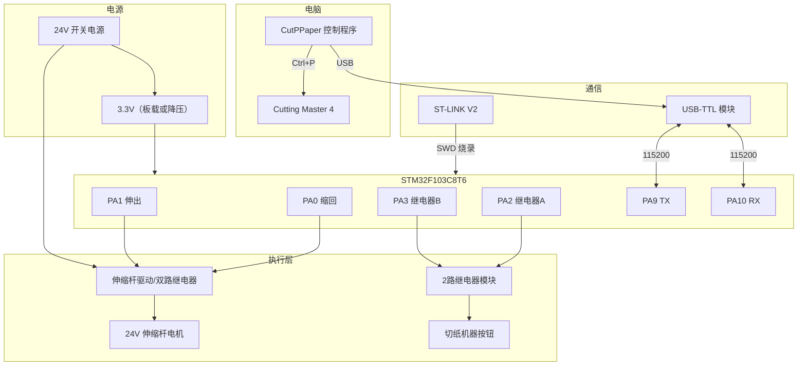

# CutPPaper 详细接线图

> 适用固件：`firmware/CutPPaper.uvprojx`  
> 主控：STM32F103C8T6 最小系统板  
> 烧录：ST-LINK V2（SWD）  
> 电脑控制：USB-TTL 模块（3.3V 电平）

**可视化版本（推荐）：** 用浏览器打开 [`wiring-diagram.html`](wiring-diagram.html)  
含思维导图、流程图、引脚图，比纯文字更直观。

---

## 一、系统总览



---

## 二、STM32 引脚分配表

| STM32 引脚 | 功能 | 连接目标 | 说明 |
|-----------|------|----------|------|
| **PA0** | 伸缩杆「缩回」 | 电机驱动 IN1 | 高电平=缩回动作 |
| **PA1** | 伸缩杆「伸出」 | 电机驱动 IN2 | 高电平=伸出动作 |
| **PA2** | 继电器 A | 继电器模块 IN1 | 模拟机器「继续」按钮 |
| **PA3** | 继电器 B | 继电器模块 IN2 | 模拟机器「原点」按钮 |
| **PA9** | USART1_TX | USB-TTL **RX** | 交叉连接 |
| **PA10** | USART1_RX | USB-TTL **TX** | 交叉连接 |
| **PA13** | SWDIO | ST-LINK SWDIO | 烧录/调试 |
| **PA14** | SWCLK | ST-LINK SWCLK | 烧录/调试 |
| **3.3V** | 电源 | ST-LINK 3.3V（可选） | 建议板子独立供电 |
| **GND** | 地 | 所有模块 GND 共地 | **必须共地** |

> 注意：PA0 在部分开发板上接有 LED，本项目中用作电机控制输出，LED 可能随电机信号闪烁，属正常现象。

---

## 三、ST-LINK 烧录接线（SWD）

```
ST-LINK V2                STM32F103C8T6 板
┌─────────────┐           ┌─────────────┐
│ SWDIO       ├───────────┤ SWDIO (PA13)│
│ SWCLK       ├───────────┤ SWCLK (PA14)│
│ 3.3V        ├─(可选)────┤ 3.3V        │
│ GND         ├───────────┤ GND         │
└─────────────┘           └─────────────┘
```

| ST-LINK | STM32 | 线色建议 |
|---------|-------|----------|
| SWDIO | SWDIO / PA13 | 绿 |
| SWCLK | SWCLK / PA14 | 蓝 |
| 3.3V | 3.3V | 红（可选） |
| GND | GND | 黑 |

- 烧录时 USB-TTL 可插着，互不影响。
- 若板子已由 USB 或外部 3.3V 供电，ST-LINK 的 3.3V **可不接**，只接 SWDIO、SWCLK、GND。

---

## 四、USB-TTL 串口接线（电脑控制）

```
USB-TTL 模块              STM32F103C8T6 板
┌─────────────┐           ┌─────────────┐
│ TX          ├───────────┤ PA10 (RX)   │  ← 交叉
│ RX          ├───────────┤ PA9  (TX)   │  ← 交叉
│ GND         ├───────────┤ GND         │
│ VCC(3.3V)   ├─(勿接)────┤             │  ← 不要接 5V！
└─────────────┘           └─────────────┘
         │
         └── USB ──→ 电脑（识别为 COM 口）
```

| USB-TTL | STM32 | 说明 |
|---------|-------|------|
| **TX** | **PA10 (RX)** | 模块发送 → MCU 接收 |
| **RX** | **PA9 (TX)** | MCU 发送 → 模块接收 |
| **GND** | **GND** | 必须连接 |
| VCC | **不接** | 模块必须选 **3.3V** 档位，且不要给 MCU 反向供电 |

- 波特率：**115200**，8N1（程序默认）。
- Windows 设备管理器中查看 COM 口号，在 CutPPaper 界面中选择。

---

## 五、24V 伸缩杆电机接线

### 方案 A：双路继电器模块驱动（推荐，与当前固件一致）

适用：2 线 DC 推杆，只需正反转。

```
                    24V 电源 (+)
                         │
                         ▼
              ┌──────────────────────┐
              │   双路继电器模块       │
              │   (5V 线圈，3.3V 可驱) │
              │                      │
  PA0 ────────┤ IN1  (缩回)           │
  PA1 ────────┤ IN2  (伸出)           │
  GND ────────┤ GND                  │
              │                      │
              │  COM1 ─ NO1 ─┐       │
              │  COM2 ─ NO2 ─┤       │
              └──────────────┼───────┘
                             │
                             ▼
                      ┌─────────────┐
                      │ 24V 伸缩杆   │
                      │  线1 / 线2   │
                      └─────────────┘
                             │
                    24V 电源 (-) ─── GND 共地
```

**逻辑（固件已实现互锁）：**

| PA0 | PA1 | 动作 |
|-----|-----|------|
| 1 | 0 | 缩回 |
| 0 | 1 | 伸出 |
| 0 | 0 | 停止 |
| 1 | 1 | **禁止**（会短路，固件不会同时输出） |

**接线步骤：**

1. 继电器模块 **VCC** 接 5V（若模块支持 3.3V 触发电平，IN 直连 PA0/PA1）。
2. 继电器模块 **GND** 与 STM32 **GND** 共地。
3. **IN1 → PA0**，**IN2 → PA1**。
4. 用两个继电器的常开触点（NO）配合 COM，接成 **H 桥换向** 或使用 **专用电机正反转双路模块**（淘宝常见「2路继电器正反转模块」）。
5. 24V 电源正负分别接到模块的电机输出端，再接到伸缩杆两根线。

### 方案 B：BTS7960 驱动模块（当前固件方案）

模块通常有两排端子：

| 控制侧 | 接法 |
|--------|------|
| **LPWM** | STM32 **PA0**（缩回时高电平） |
| **RPWM** | STM32 **PA1**（伸出时高电平） |
| **R_EN** | **5V** 常高（可与 VCC 短接） |
| **L_EN** | **5V** 常高 |
| **R_IS / L_IS** | **不接**（电流检测，本方案不用） |
| **VCC** | **5V** 逻辑电源 |
| **GND** | 系统 **GND**（与 STM32、24V 负极共地） |

| 功率侧 | 接法 |
|--------|------|
| **B+** | **24V 电源正极**（电机主电源） |
| **B-** | **24V 电源负极 / GND** |
| **M+ / M-** | 伸缩杆电机两根线（方向反了对调即可） |

**逻辑（固件已实现互锁，与 BTS7960 数字控制模式一致）：**

| PA0 | PA1 | LPWM | RPWM | 动作 |
|-----|-----|------|------|------|
| 1 | 0 | 高 | 低 | 缩回 |
| 0 | 1 | 低 | 高 | 伸出 |
| 0 | 0 | 低 | 低 | 停止 |

> **注意：** 24V 只接 **B+**，不要接到 **VCC**。R_EN/L_EN 必须使能（接 5V），否则电机不转。

### 方案 C：L298N 等其它驱动（未用）

```
PA0 ──→ IN1 (或方向脚 A)
PA1 ──→ IN2 (或方向脚 B)
GND ──→ GND（与 STM32、24V 电源共地）
24V ──→ 驱动模块 motor power
驱动 OUT1/OUT2 ──→ 伸缩杆两根线
```

---

## 六、机器按钮模拟接线（继电器 A / B）

继电器用于 **并联** 切纸机面板上的实体按钮，相当于帮你在按钮两端短接一下。

### 继电器 A → 机器「继续」按钮

```
机器「继续」按钮原有接线：
    [继续键]── 线A ──┬── 线B
                     │
         继电器A 常开触点(NO) 并联：
                     │
    COM ─────────────┤
    NO  ─────────────┘
         （短触 = 模拟按一下继续）

STM32 PA2 ──→ 继电器A 模块 IN
```

### 继电器 B → 机器「原点」按钮

```
机器「原点」按钮原有接线：
    [原点键]── 线C ──┬── 线D
                     │
         继电器B 常开触点(NO) 并联：
                     │
    COM ─────────────┤
    NO  ─────────────┘

STM32 PA3 ──→ 继电器B 模块 IN
```

### 推荐用 **4 路继电器模块** 统一驱动

| 继电器通道 | STM32 | 用途 |
|-----------|-------|------|
| CH1 (IN1) | PA0 | 伸缩杆缩回（若电机独立模块则不用此路） |
| CH2 (IN2) | PA1 | 伸缩杆伸出 |
| CH3 (IN3) | PA2 | 机器「继续」 |
| CH4 (IN4) | PA3 | 机器「原点」 |

> 若伸缩杆用独立双路电机模块，则 4 路继电器模块只接 PA2、PA3 两路即可；PA0/PA1 接电机驱动板。

**重要：**

- 先确认机器按钮是 **低压干触点**（无电压或 5~24V 弱电），再并联继电器。
- 若按钮带 **220V 或强电**，必须使用 **隔离继电器** 或 **光耦隔离模块**，不可直接并联。
- 用万用表 **通断档** 测按钮：未按下开路，按下短路，则可用 NO 触点并联。

---

## 七、电源与共地

```
                    ┌─────────────────┐
   220V AC ────────→│ 24V 开关电源     │
                    │ (电流 ≥ 电机额定) │
                    └───┬─────────┬───┘
                        │         │
                     24V+       24V- (GND)
                        │         │
            ┌───────────┼─────────┼───────────┐
            │           │         │           │
            ▼           ▼         ▼           ▼
      电机驱动模块   继电器模块   DC-DC降压    (粗线、短)
            │           │         │
            │           │      5V/3.3V
            │           │         │
            └───────────┴────┬────┘
                             │
                        STM32 GND
                        USB-TTL GND
                        ST-LINK GND
                        所有 GND 连在一起
```

| 电源 | 用途 | 建议 |
|------|------|------|
| 24V | 伸缩杆电机 | 电流按电机铭牌，建议留 30% 余量 |
| 5V 或 3.3V | STM32 板、继电器线圈 | 可用 24V→5V→3.3V 降压模块 |
| USB | ST-LINK、USB-TTL | 各自 USB 供电即可 |

**共地规则：**

- 24V 电源负极 = 整个系统的 **GND 参考点**。
- STM32、USB-TTL、继电器、电机驱动 **必须共地**。
- **24V 正极不要** 接到 STM32 任何引脚。

---

## 八、完整接线实物对照（文字版）

```
┌─────────────────────────────────────────────────────────────────────────┐
│                              电 脑                                       │
│  ┌──────────────┐    USB      ┌──────────────┐    USB    ┌───────────┐ │
│  │ CutPPaper    │◄───────────►│ USB-TTL      │           │ ST-LINK   │ │
│  │ 控制程序      │             │ (3.3V)       │           │           │ │
│  └──────┬───────┘             └───┬──────────┘           └─────┬─────┘ │
│         │ Ctrl+P                  │ TX/RX/GND                   │ SWD   │
│         ▼                           │                             │       │
│  ┌──────────────┐                   │                             │       │
│  │ Cutting      │                   │                             │       │
│  │ Master 4     │                   │                             │       │
│  └──────────────┘                   │                             │       │
└─────────────────────────────────────┼─────────────────────────────┼───────┘
                                      │                             │
                    ┌─────────────────▼─────────────────────────────▼───────┐
                    │              STM32F103C8T6 最小系统板                    │
                    │  PA9(TX) PA10(RX)  PA0 PA1  PA2  PA3  GND  SWDIO/SWCLK  │
                    └──┬────┬─────────┬───┬───┬───┬───┬──────────────────────┘
                       │    │         │   │   │   │   │
              USB-TTL ─┘    └─ USB-TTL│   │   │   │   └── GND 共地
                                        │   │   │   │
                    ┌───────────────────┘   │   │   └──────────────┐
                    ▼                       ▼   ▼                  ▼
            ┌───────────────┐        ┌─────────────────┐   ┌──────────────┐
            │ 伸缩杆驱动模块  │        │ 4路继电器模块    │   │ 24V 电源      │
            │ IN1←PA0 缩回   │        │ IN←PA2 继续(A)  │   │ + / -        │
            │ IN2←PA1 伸出   │        │ IN←PA3 原点(B)  │   └──────┬───────┘
            └───┬───────────┘        └────────┬────────┘          │
                │                             │ NO/COM 并联        │
                ▼                             ▼                    │
         ┌─────────────┐              ┌─────────────┐             │
         │ 24V 伸缩杆   │              │ 切纸机面板   │◄────────────┘
         │  电机       │              │ 继续 / 原点  │
         └─────────────┘              │  按钮       │
                                       └─────────────┘
```

---

## 九、推荐线材与端子

| 用途 | 线径 | 说明 |
|------|------|------|
| 24V 电机 | 0.75~1.5 mm² | 尽量短，与信号线分开 |
| STM32 信号 | 杜邦线 | PA0~PA3、串口、SWD |
| 继电器→机器按钮 | 0.5 mm² 屏蔽线可选 | 与电机线分开走 |
| 共地 | 粗一点或星形汇到一点 | 避免地环路干扰 |

---

## 十、接线顺序（建议）

1. **断电** 状态下，先接好所有 **GND 共地**。
2. 接 **ST-LINK**，Keil 烧录固件，确认能下载。
3. 接 **USB-TTL**，串口助手发 `PING`，应返回 `OK:PONG`。
4. **不接电机**，只接 PA0/PA1 到驱动模块，听继电器吸合声或用万用表测。
5. 接 **24V 电源**，伸缩杆 **空载短行程** 试缩回/伸出。
6. 继电器 A/B **不接机器**，用万用表测 NO 触点通断。
7. 确认按钮为 **干触点后**，再将 NO 并联到「继续」「原点」。
8. 电脑运行 CutPPaper，**模拟模式关闭**，完整联调。

---

## 十一、安全与故障排查

| 现象 | 可能原因 | 处理 |
|------|----------|------|
| 串口无响应 | TX/RX 未交叉、GND 未接 | 对调 TX/RX，确认共地 |
| 烧录失败 | SWD 线松、BOOT 跳线不对 | 检查 PA13/14，BOOT0 接 GND |
| 电机不动 | 24V 未接、驱动使能未开 | 测 24V 输出、IN 电平 |
| 电机只朝一个方向 | 两根电机线接反 | 对调电机线 |
| 继电器不吸合 | IN 电平不够 | 确认 3.3V 触发或加 5V 继电器模块 |
| 机器无反应 | 按钮不是干触点 | 用万用表确认后再并联 |
| 程序发命令但无动作 | COM 口选错 | 设备管理器确认 COM 号 |

---

## 十二、CutPPaper 流程与接线对应关系

| 软件步骤 | STM32 动作 | 硬件 |
|----------|-----------|------|
| 2-1 缩回 | `RETRACT` → PA0=1 | 伸缩杆缩回 |
| 2-2 继续 | `PULSE_A` → PA2 脉冲 | 继电器 A 短触「继续」 |
| 2-3 切割 | PC 发 Ctrl+P | Cutting Master 4 |
| 3 伸出 | `EXTEND` → PA1=1 | 伸缩杆伸出 |
| 4 原点 | `PULSE_B` → PA3 脉冲 | 继电器 B 短触「原点」 |

---

如有具体模块型号（继电器板、电机驱动板照片），可补充到本文档对应章节以便精确到端子编号。
