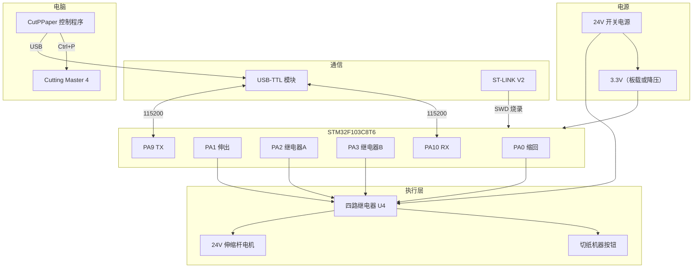

# CutPPaper 详细接线图

> 适用固件：`firmware/CutPPaper.uvprojx`  
> 主控：STM32F103C8T6 最小系统板  
> 烧录：ST-LINK V2（SWD）  
> 电脑控制：USB-TTL 模块（3.3V 电平）

**可视化版本（推荐）：** 用浏览器打开 [`wiring-diagram.html`](wiring-diagram.html)  
含思维导图、流程图、引脚图，比纯文字更直观。

---

## 一、系统总览



---

## 二、STM32 引脚分配表

| STM32 引脚 | 功能 | 连接目标 | 说明 |
|-----------|------|----------|------|
| **PA0** | 伸缩杆「缩回」 | 四路继电器 **IN1** | 缩回时仅 PA0 为高 |
| **PA1** | 伸缩杆「伸出」 | 四路继电器 **IN2** | 伸出时仅 PA1 为高 |
| **PA2** | 继电器 A | 四路继电器 **IN3** | 脉冲模拟「继续」 |
| **PA3** | 继电器 B | 四路继电器 **IN4** | 脉冲模拟「原点」 |
| **PA9** | USART1_TX | USB-TTL **RX** | 交叉连接 |
| **PA10** | USART1_RX | USB-TTL **TX** | 交叉连接 |
| **PA7** | 伸缩切换按键 | 实体按钮 → GND | 按一次缩回 3 秒，再按伸出 3 秒，交替 |
| **PA13** | SWDIO | ST-LINK SWDIO | 烧录/调试 |
| **PA14** | SWCLK | ST-LINK SWCLK | 烧录/调试 |
| **3.3V** | 电源 | ST-LINK 3.3V（可选） | 建议板子独立供电 |
| **GND** | 地 | 所有模块 GND 共地 | **必须共地** |

> 注意：PA0 在部分开发板上接有 LED，本项目中用作电机控制输出，LED 可能随电机信号闪烁，属正常现象。

---

## 三、ST-LINK 烧录接线（SWD）

```
ST-LINK V2                STM32F103C8T6 板
┌─────────────┐           ┌─────────────┐
│ SWDIO       ├───────────┤ SWDIO (PA13)│
│ SWCLK       ├───────────┤ SWCLK (PA14)│
│ 3.3V        ├─(可选)────┤ 3.3V        │
│ GND         ├───────────┤ GND         │
└─────────────┘           └─────────────┘
```

| ST-LINK | STM32 | 线色建议 |
|---------|-------|----------|
| SWDIO | SWDIO / PA13 | 绿 |
| SWCLK | SWCLK / PA14 | 蓝 |
| 3.3V | 3.3V | 红（可选） |
| GND | GND | 黑 |

- 烧录时 USB-TTL 可插着，互不影响。
- 若板子已由 USB 或外部 3.3V 供电，ST-LINK 的 3.3V **可不接**，只接 SWDIO、SWCLK、GND。

---

## 四、USB-TTL 串口接线（电脑控制）

```
USB-TTL 模块              STM32F103C8T6 板
┌─────────────┐           ┌─────────────┐
│ TX          ├───────────┤ PA10 (RX)   │  ← 交叉
│ RX          ├───────────┤ PA9  (TX)   │  ← 交叉
│ GND         ├───────────┤ GND         │
│ VCC(3.3V)   ├─(勿接)────┤             │  ← 不要接 5V！
└─────────────┘           └─────────────┘
         │
         └── USB ──→ 电脑（识别为 COM 口）
```

| USB-TTL | STM32 | 说明 |
|---------|-------|------|
| **TX** | **PA10 (RX)** | 模块发送 → MCU 接收 |
| **RX** | **PA9 (TX)** | MCU 发送 → 模块接收 |
| **GND** | **GND** | 必须连接 |
| VCC | **不接** | 模块必须选 **3.3V** 档位，且不要给 MCU 反向供电 |

- 波特率：**115200**，8N1（程序默认）。
- Windows 设备管理器中查看 COM 口号，在 CutPPaper 界面中选择。
- **PA6 串口 LED**：快闪 = 未连接/无通信；连接成功后约每 1.5 秒 PING 一次，变为**慢呼吸**。
- 烧录或拔插 USB 后须在 CutPPaper 里**重新点连接**（MCU 会重启，旧连接失效）。
- 部分 CH340 模块 **RTS 接 NRST**：打开串口时控制线状态不对会导致 MCU 无响应；软件已固定 `DTR=1, RTS=1` 并在连接后等待约 350ms。

---

## 五、四路继电器统一接线（电机 + 按钮）

> **当前方案**：2 线伸缩杆用 K1/K2 组成 **H 桥**：24V/GND 接 NO/NC 拱桥，电机接 COM1/COM2。任意 IN 组合**不会短路电源**。  
> **固件（跳线 H）**：缩回 = 仅 K1；伸出 = 仅 K2；停止 = 全释放；换向前先停 80ms。

### 5.1 控制侧

| 端子 | 接法 |
|------|------|
| **DC+** | **12V**（12V 光耦继电器模块；5V 模块则接 5V。**勿接 24V**） |
| **DC-** | **GND**（与 STM32、24V 负极共地） |
| **IN1** | PA0（K1 缩回） |
| **IN2** | PA1（K2 伸出） |
| **IN3** | PA2（K3 继续，脉冲） |
| **IN4** | PA3（K4 原点，脉冲） |

跳线 **S1~S4 插在 H** = 高电平触发（STM32 输出 3.3V 吸合）。

> **光耦继电器**一般听不到机械「咔嗒」声，属正常。可用万用表测触点通断，或看模块上 LED 指示灯是否亮。

### 5.2 通道总表

| 通道 | IN | STM32 | 触点 | 用途 |
|------|-----|-------|------|------|
| K1 | IN1 | PA0 | COM1 NO1 NC1 | H 桥 COM1 → 电机线 A |
| K2 | IN2 | PA1 | COM2 NO2 NC2 | H 桥 COM2 → 电机线 B |
| K3 | IN3 | PA2 | COM3 NO3 NC3 | 并联「继续」 |
| K4 | IN4 | PA3 | COM4 NO4 NC4 | 并联「原点」 |

### 5.3 电机 H 桥接线（2 线，推荐，防短路）

**原则**：电源接在 **NO/NC 拱桥**，负载接在 **COM**；不要把 NC 与 NO 跨继电器并到同一电机线（会短路）。

```
24V+ ──┬── NO1
       └── NO2

GND  ──┬── NC1
       └── NC2        （与 STM32、继电器 DC- 共地）

伸缩杆线 A ── COM1
伸缩杆线 B ── COM2
```

用短导线在继电器螺丝上把 NO1–NO2、NC1–NC2 分别连在一起即可。

#### 跳线 H（高电平触发，当前默认）

| PA0 | PA1 | K1 | K2 | COM1 | COM2 | 结果 |
|-----|-----|----|----|------|------|------|
| 0 | 0 | 释放 | 释放 | NC1(GND) | NC2(GND) | **停止**（两端同 GND） |
| 1 | 0 | 吸合 | 释放 | NO1(+24V) | NC2(GND) | **缩回**（电流 A→B） |
| 0 | 1 | 释放 | 吸合 | NC1(GND) | NO2(+24V) | **伸出**（电流 B→A） |
| 1 | 1 | 吸合 | 吸合 | NO1(+24V) | NO2(+24V) | **停止**（两端同 +24V，刹车） |

- 任意 PA0/PA1 组合 **不会** 把 24V+ 与 GND 直接短接。
- 换向前固件先全释放 80ms，再吸合另一路（保护触点）。
- 方向反了：对调伸缩杆 A/B 两根线，或交换固件缩回/伸出定义。
- **NC3、NC4 不接**（按钮只用 COM/NO）。

#### 跳线 L（低电平触发）

逻辑与上表 **相反**：GPIO **低电平** 吸合。若使用 L 跳线，须改固件取反 PA0/PA1，或改回 H 跳线。

> **勿用** COM1=24V+、COM2=GND 再把 NO/NC 并到电机线的旧方案，也 **勿用** NC1 与 NO2 并到同一电机端的交叉接法，均可能短路。

### 5.4 伸缩杆实体按键（PA7）

现场手动控制伸缩杆，与电脑串口命令可并存：

```
PA7 ── 切换按钮 ── GND
```

| 引脚 | 功能 | 操作 |
|------|------|------|
| **PA7** | 伸缩切换 | **按一次**缩回 3 秒并自动停止；**再按一次**伸出 3 秒并自动停止，交替循环 |

- 固件内部上拉，按下为低电平；建议用常开轻触开关或面板按钮。
- 每次动作固定 **3 秒**（`BUTTON_ACTION_MS`），运行中再次按键无效。
- 实体键仅在**本键曾驱动电机**时到时才发 `STOP`，不影响电脑下发的 `RETRACT`/`EXTEND` 保持运行。
- **PA8** 未使用，可悬空。

### 5.5 按钮并联（K3/K4）

```
继续按钮两端 ── COM3 / NO3 并联（NC3 不接）
原点按钮两端 ── COM4 / NO4 并联（NC4 不接）
```

须为 **低压干触点**；220V 强电须光耦隔离。

### 5.6 从旧接法迁移

1. 拆掉 COM1/COM2 接 24V/GND、电机线接 NO/NC 的旧线。
2. 按 §5.3：**NO1–NO2 拱桥接 24V+**，**NC1–NC2 拱桥接 GND**，**COM1/COM2 接电机两根线**。
3. 跳线保持 **H**（与当前固件一致）。
4. 重新烧录固件；缩回仅 IN1 亮，伸出仅 IN2 亮。

---

## 六、上电调试与安全

1. **先不接 24V**，确认 NO1–NO2、NC1–NC2 拱桥正确，COM1/COM2 只接电机。
2. 单步 **缩回**：仅 **IN1** 亮；**伸出**：仅 **IN2** 亮。
3. 接 **24V**，空载试缩回/伸出；方向反了对调 COM1/COM2 上的电机线。
5. K3/K4 **不接机器**，测 COM3/NO3、COM4/NO4 通断。
6. 确认按钮为干触点后，再并联到切割机面板。

**禁止：** 24V 接到继电器 **DC+**；把 **NC 与 NO 跨路并到同一电机线**（易短路）。

---

## 七、电源与共地

```
                    ┌─────────────────┐
   220V AC ────────→│ 24V 开关电源     │
                    │ (电流 ≥ 电机额定) │
                    └───┬─────────┬───┘
                        │         │
                     24V+       24V- (GND)
                        │         │
            ┌───────────┼─────────┼───────────┐
            │           │         │           │
            ▼           ▼         ▼           ▼
      继电器触点(24V电机)  继电器模块   DC-DC降压    (粗线、短)
            │           │         │
            │           │      5V/3.3V
            │           │         │
            └───────────┴────┬────┘
                             │
                        STM32 GND
                        USB-TTL GND
                        ST-LINK GND
                        所有 GND 连在一起
```

| 电源 | 用途 | 建议 |
|------|------|------|
| 24V | 伸缩杆电机 | 电流按电机铭牌，建议留 30% 余量 |
| 5V 或 3.3V | STM32 板、继电器线圈 | 可用 24V→5V→3.3V 降压模块 |
| USB | ST-LINK、USB-TTL | 各自 USB 供电即可 |

**共地规则：**

- 24V 电源负极 = 整个系统的 **GND 参考点**。
- STM32、USB-TTL、继电器 **必须共地**。
- **24V 正极不要** 接到 STM32 任何引脚。

---

## 八、完整接线实物对照（文字版）

```
┌─────────────────────────────────────────────────────────────────────────┐
│                              电 脑                                       │
│  ┌──────────────┐    USB      ┌──────────────┐    USB    ┌───────────┐ │
│  │ CutPPaper    │◄───────────►│ USB-TTL      │           │ ST-LINK   │ │
│  │ 控制程序      │             │ (3.3V)       │           │           │ │
│  └──────┬───────┘             └───┬──────────┘           └─────┬─────┘ │
│         │ Ctrl+P                  │ TX/RX/GND                   │ SWD   │
│         ▼                           │                             │       │
│  ┌──────────────┐                   │                             │       │
│  │ Cutting      │                   │                             │       │
│  │ Master 4     │                   │                             │       │
│  └──────────────┘                   │                             │       │
└─────────────────────────────────────┼─────────────────────────────┼───────┘
                                      │                             │
                    ┌─────────────────▼─────────────────────────────▼───────┐
                    │              STM32F103C8T6 最小系统板                    │
                    │  PA9(TX) PA10(RX)  PA0 PA1  PA2  PA3  GND  SWDIO/SWCLK  │
                    └──┬────┬─────────┬───┬───┬───┬───┬──────────────────────┘
                       │    │         │   │   │   │   │
              USB-TTL ─┘    └─ USB-TTL│   │   │   │   └── GND 共地
                                        │   │   │   │
                    ┌───────────────────┘   │   │   └──────────────┐
                    ▼                       ▼   ▼                  ▼
            ┌─────────────────────────────────────────┐
            │         四路继电器 U4（同一块板）           │
            │ DC+←12V  DC-←GND                        │
            │ IN1←PA0  IN2←PA1  IN3←PA2  IN4←PA3     │
            │ NO1─NO2 拱桥←24V+  NC1─NC2 拱桥←GND          │
            │ COM1/COM2 → 24V 伸缩杆电机                    │
            │ COM3/NO3 → 继续   COM4/NO4 → 原点        │
            └───────────┬─────────────────┬───────────┘
                        │                 │
                        ▼                 ▼
                 ┌─────────────┐   ┌─────────────┐
                 │ 24V 伸缩杆   │   │ 切纸机按钮   │
                 │   电机       │   │ 继续 / 原点  │
                 └─────────────┘   └─────────────┘
```

---

## 九、推荐线材与端子

| 用途 | 线径 | 说明 |
|------|------|------|
| 24V 电机 | 0.75~1.5 mm² | 尽量短，与信号线分开 |
| STM32 信号 | 杜邦线 | PA0~PA3、串口、SWD |
| 继电器→机器按钮 | 0.5 mm² 屏蔽线可选 | 与电机线分开走 |
| 共地 | 粗一点或星形汇到一点 | 避免地环路干扰 |

---

## 十、接线顺序（建议）

1. **断电** 状态下，先接好所有 **GND 共地**。
2. 接 **ST-LINK**，Keil 烧录固件，确认能下载。
3. 接 **USB-TTL**，串口助手发 `PING`，应返回 `OK:PONG`。
4. **不接电机**，PA0/PA1 单步测试，听 K1/K2 吸合、测触点通断。
5. 接 **24V**，伸缩杆 **空载短行程** 试缩回/伸出。
6. K3/K4 **不接机器**，测 NO3/NO4 通断。
7. 确认按钮为 **干触点后**，再将 NO 并联到「继续」「原点」。
8. 电脑运行 CutPPaper，**模拟模式关闭**，完整联调。

---

## 十一、安全与故障排查

| 现象 | 可能原因 | 处理 |
|------|----------|------|
| 串口无响应 | TX/RX 未交叉、GND 未接 | 对调 TX/RX，确认共地 |
| 烧录失败 | SWD 线松、BOOT 跳线不对 | 检查 PA13/14，BOOT0 接 GND |
| 电机不动 | 24V 未接、K1/K2 未吸合、触点接错 | 测 24V、IN1/IN2 电平、COM/NO/NC |
| 电机只朝一个方向 | 一侧继电器或 NC 未接 | 查 K1/K2 接线，对调电机线 |
| 电机嗡嗡/一直通电 | 旧交叉接法或 NC2 误接 | 改 §5.3 接法；NC2 悬空；重烧固件 |
| 继电器不吸合 | IN 电平不够 | 确认 3.3V 触发或加 5V 继电器模块 |
| 机器无反应 | 按钮不是干触点 | 用万用表确认后再并联 |
| 程序发命令但无动作 | COM 口选错 | 设备管理器确认 COM 号 |

---

## 十二、CutPPaper 流程与接线对应关系

| 软件步骤 | STM32 动作 | 硬件 |
|----------|-----------|------|
| 2-1 缩回 | `RETRACT` → PA0=1 PA1=0 | 仅 K1：COM1=+24V COM2=GND |
| 2-2 继续 | `PULSE_A` → PA2 脉冲 | K3(IN3) 短触「继续」 |
| 2-3 切割 | PC 发 Ctrl+P | Cutting Master 4 |
| 3 伸出 | `EXTEND` → PA0=0 PA1=1 | 仅 K2：COM1=GND COM2=+24V |
| 4 原点 | `PULSE_B` → PA3 脉冲 | K4(IN4) 短触「原点」 |

---

如有具体模块型号（继电器板、电机驱动板照片），可补充到本文档对应章节以便精确到端子编号。
